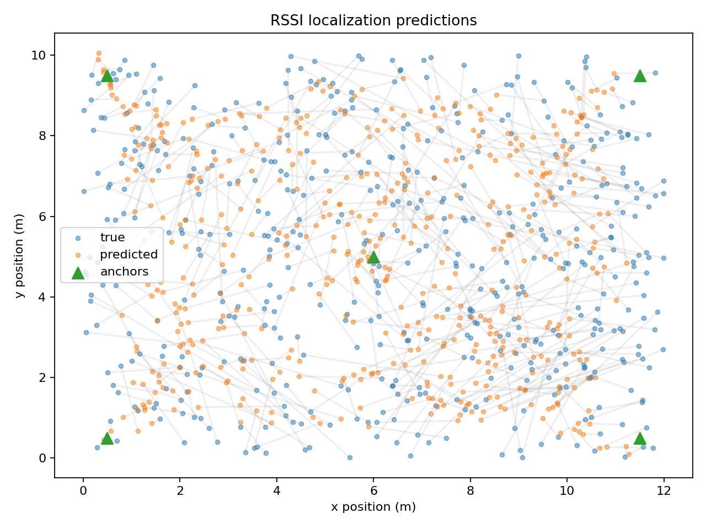
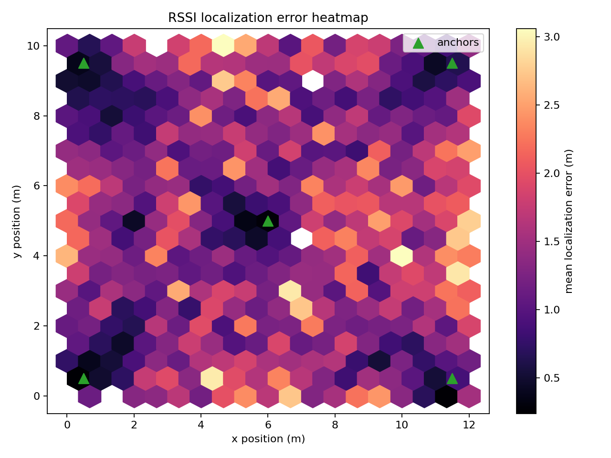

# RSSI Localization Agent

Portfolio-grade RSSI indoor localization project using simulation, classical baselines, and neural network regression.

The system estimates a receiver's 2D position from RSSI measurements collected from fixed anchors.

```text
RSSI readings from N anchors -> localization model -> estimated (x, y)
```

## Why This Project Exists

RSSI localization is a useful applied machine learning problem because the data is noisy, physics-informed, and spatial. This repository demonstrates an end-to-end workflow:

- synthetic data generation using a log-distance path loss model
- baseline localization with RSSI-derived distances and trilateration
- neural network regression with PyTorch
- evaluation with localization error in meters
- reusable agent wrapper for inference

## Project Structure

```text
rssi-localization-agent/
  configs/
    default.yaml
  scripts/
    simulate_data.py
    train_model.py
    evaluate_model.py
  src/
    rssi_localization/
      agents/
      data/
      models/
      simulation/
      training/
      visualization/
  tests/
  pyproject.toml
  README.md
```

## Method

The simulator places anchors at known coordinates and samples receiver locations inside a rectangular environment. RSSI is generated with the log-distance path loss model:

```text
RSSI(d) = P0 - 10 * n * log10(d / d0) + noise
```

Where:

- `P0` is RSSI at reference distance `d0`
- `n` is the path loss exponent
- `noise` models measurement uncertainty and multipath effects

The supervised learning task is:

```text
input:  RSSI vector [rssi_anchor_1, ..., rssi_anchor_n]
output: receiver position [x, y]
```

## Quickstart

Create a virtual environment, then install the project:

```powershell
python -m venv .venv
.\.venv\Scripts\Activate.ps1
python -m pip install --upgrade pip
python -m pip install -e ".[dev]"
```

Generate data:

```powershell
python scripts/simulate_data.py --config configs/default.yaml
```

Train the neural network:

```powershell
python scripts/train_model.py --config configs/default.yaml
```

Evaluate the trained model and the trilateration baseline:

```powershell
python scripts/evaluate_model.py --config configs/default.yaml
```

View tracked experiments with MLflow:

```powershell
mlflow ui --backend-store-uri sqlite:///mlflow.db
```

Then open:

```text
http://127.0.0.1:5000
```

Run tests:

```powershell
pytest
```

## API

Start the FastAPI service:

```powershell
rssi-api --host 0.0.0.0 --port 8000
```

Check service health:

```powershell
curl http://127.0.0.1:8000/health
```

Send an RSSI prediction request:

```powershell
curl -X POST http://127.0.0.1:8000/predict `
  -H "Content-Type: application/json" `
  -d "{\"rssi_dbm\": [-61, -74, -68, -82, -57]}"
```

The API loads model artifacts from `configs/default.yaml` by default. Override paths with:

```text
RSSI_CONFIG_PATH
RSSI_MODEL_PATH
RSSI_SCALER_PATH
RSSI_DEVICE
```

## Docker

Build the image:

```powershell
docker build -t rssi-localization-agent .
```

Run the API container:

```powershell
docker run --rm -p 8000:8000 rssi-localization-agent
```

Run a specific project command:

```powershell
docker run --rm rssi-localization-agent rssi-simulate --config configs/ci.yaml
```

Generated data and artifacts are intentionally excluded from the image build context.

Build and run the container test target:

```powershell
docker build --target test -t rssi-localization-agent:test .
docker run --rm rssi-localization-agent:test pytest
```

## Continuous Integration

This repository uses GitHub Actions for CI. On every push or pull request to `main`, the workflow:

- installs the package
- runs Ruff linting
- runs unit tests
- generates a small deterministic CI dataset
- trains a short smoke-test model
- evaluates the smoke-test model
- uploads CI metrics and prediction plots as workflow artifacts
- builds a Docker test image
- runs unit tests inside the container
- runs the CI smoke pipeline inside the container
- builds the runtime Docker image

The CI workflow uses `configs/ci.yaml`, which is intentionally small so CI validates the pipeline without running a full experiment.

## Experiment Tracking

Training and evaluation runs are tracked with MLflow. By default, run metadata is written to a local SQLite backend store:

```text
mlflow.db
```

Run artifacts are written to:

```text
mlartifacts/
```

The project logs:

- configuration parameters
- training and validation loss per epoch
- saved model and scaler artifacts
- evaluation metrics for the neural network and trilateration baseline
- prediction plot
- error heatmap
- experiment report

Tracking is configured in each YAML file:

```yaml
tracking:
  enabled: true
  tracking_uri: sqlite:///mlflow.db
  artifact_location: mlartifacts
  experiment_name: rssi-localization
```

`mlflow.db`, `mlruns/`, and `mlartifacts/` are intentionally ignored by Git because they are generated experiment state.

## Results

After running evaluation, metrics are written to:

```text
artifacts/metrics.json
```

The standard experiment output bundle is:

```text
artifacts/
  metrics.json
  predictions.png
  error_heatmap.png
  report.md
```

The main metric is localization error in meters:

- mean error
- median error
- 90th percentile error
- 95th percentile error

Current full synthetic experiment using `configs/default.yaml`:

| Method | Mean error | Median error | P90 error | P95 error |
| --- | ---: | ---: | ---: | ---: |
| Neural network | 1.438 m | 1.265 m | 2.642 m | 3.257 m |
| Trilateration baseline | 4.225 m | 3.137 m | 8.523 m | 11.736 m |

The prediction plot compares true receiver positions against neural-network estimates. Shorter gray lines indicate lower localization error.



The error heatmap shows where model error is spatially concentrated across the simulated indoor environment.



## Roadmap

- Add real RSSI measurement ingestion
- Add experiment tracking with MLflow or Weights & Biases
- Add FastAPI inference endpoint
- Add Docker image
- Add richer indoor effects such as walls, shadowing, and anchor dropout
- Add uncertainty estimation
